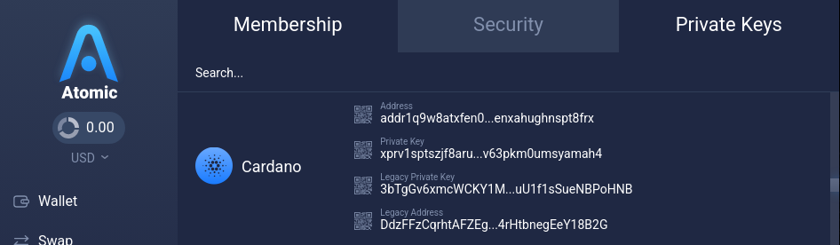
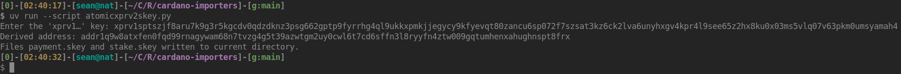
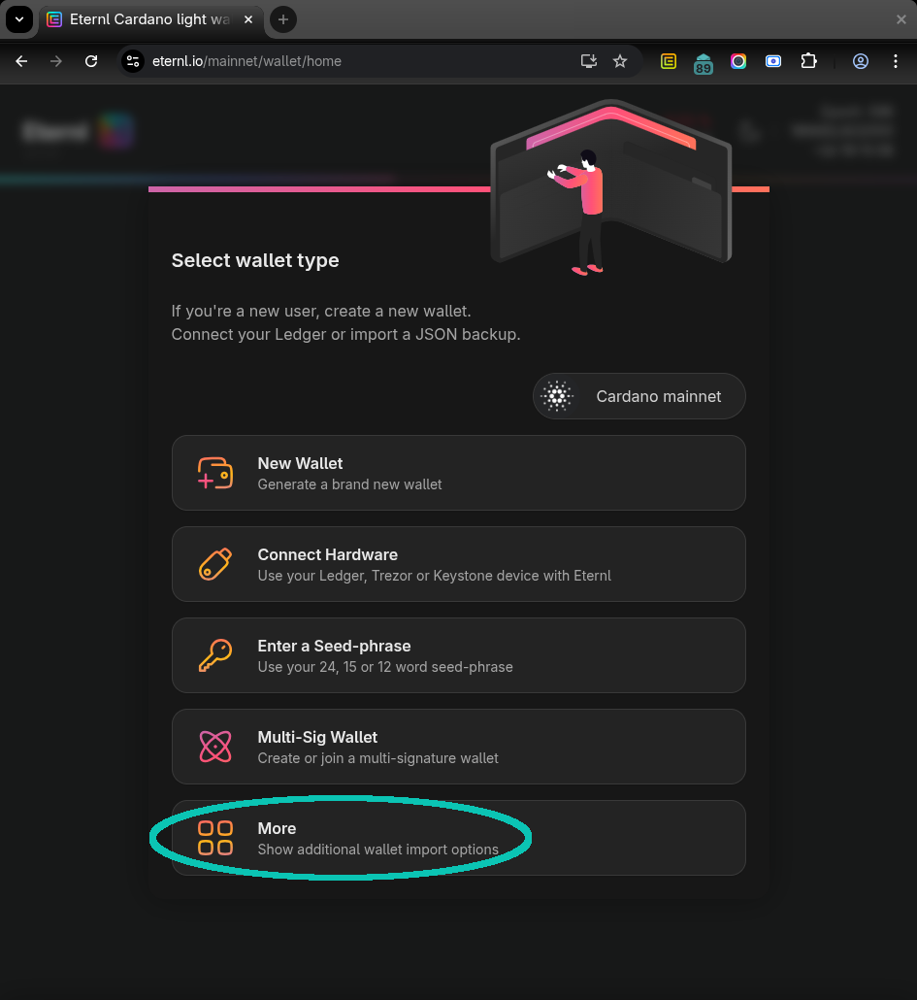
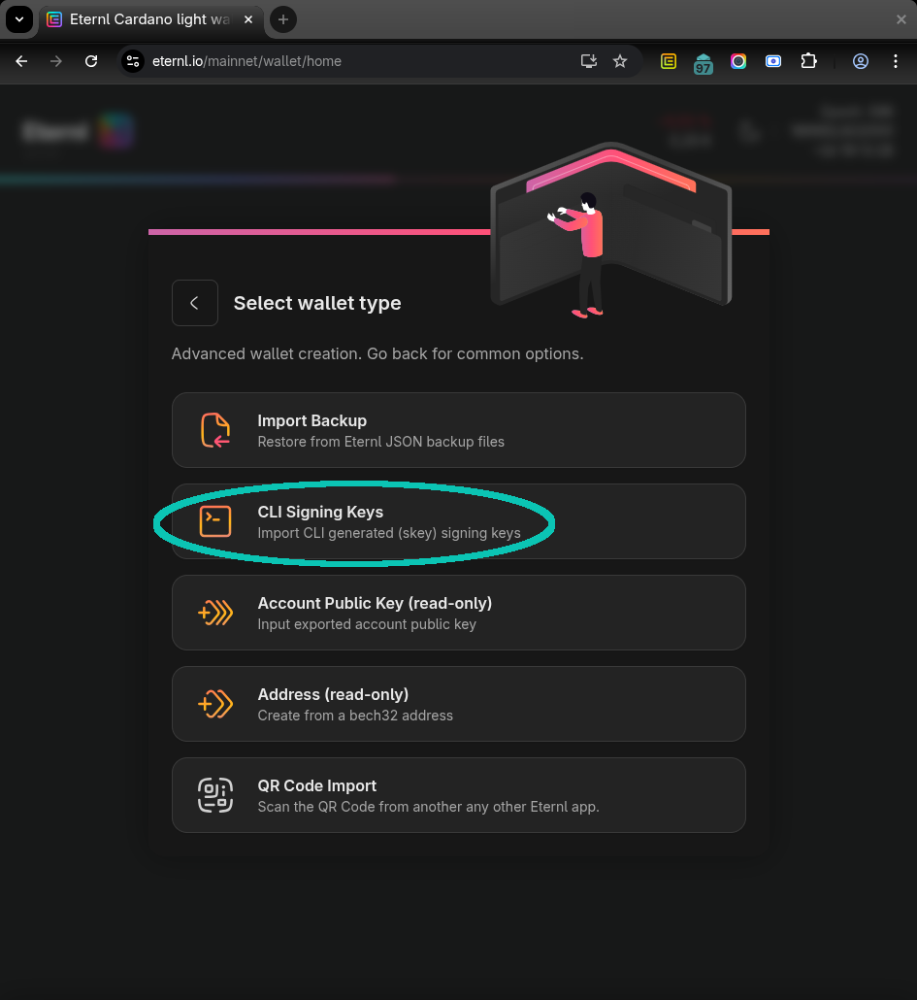

# Cardano Importers
Importers for some exotic wallet apps

[Cardano wallet apps](https://cardano.org/what-is-ada#wallets) usually use
24, 15, or 12 word seed phrases to export and import wallets.
It is important to keep those seed phrases safe and secure.
They give full access to the wallet and all its accounts/sub-wallets.
The seed phrases are mostly compatible and users can switch between wallet
apps or use them in parallel by importing a wallet using the seed phrase.

There are [Cardano Improvement Proposals (CIPs)](https://cips.cardano.org/)
for establishing how seed phrases, keys, and wallets should be handled on
Cardano.
The generation of root keys from seed phrases is specified in
[CIP 3](https://cips.cardano.org/cip/CIP-0003), the derivation of account,
payment, and stake keys from these root keys in
[CIP 1852](https://cips.cardano.org/cip/CIP-1852), the construction of
addresses from (the hashes of) these keys in
[CIP 19](https://cips.cardano.org/cip/CIP-0019), and human-readable prefixes
for [Bech32](https://github.com/bitcoin/bips/blob/master/bip-0173.mediawiki)
encodings of keys on different levels of the derivation hierarchy in
[CIP 5](https://cips.cardano.org/cip/CIP-0005).

Some wallet apps – especially multi-chain ones – do things differently,
though, and can often not be just imported.
This repository contains some scripts to convert different kinds of
keys/secrets to the `.skey` private key files used by
[`cardano-cli`](https://github.com/IntersectMBO/cardano-cli).
Apart from using `cardano-cli`, these key files can also be imported into
the Cardano wallet app [Eternl](https://eternl.io/) as shown
[below](#importing-skey-files-to-eternl).

For running these Python scripts, I recommend getting
[`uv`](https://docs.astral.sh/uv/getting-started/installation/).
The scripts are written as single file scripts with their dependencies
specified in the header, so that `uv` can automatically get them.
If you know your Python, you can choose any other preferred method of
installing the dependencies and running the scripts, of course.

## Exodus seed phrases: `exodus2skey.py`
TODO

## Atomic private keys: `atomicxprv2skey.py`
[Atomic Wallet](https://atomicwallet.io/)'s seed phrases are compatible with
Cardano wallet apps.
As a test wallet, we use the seed phrase `twelve twelve twelve twelve twelve
twelve twelve twelve twelve twelve twelve twelve` (twelve times “twelve”).
In Atomic as well as in Eternl (and other Cardano wallet apps), this leads to
the wallet with the address
`addr1q9w8atxfen0fqd99rnagywam68n7tvzg4g5t39azwtgm2uy0cwl6t7cd6sffn3l8ryyfn4ztw009gqtumhenxahughnspt8frx`.

But additionally, Atomic also allows to copy and save an extended private key
in Bech32 encoding with the human-readable prefix `xprv`:

This extended private key –
`xprv1sptszjf8aru7k9g3r5kgcdv0qdzdknz3psg662gptp9fyrrhg4ql9ukkxpmkjjegycy9kfyevqt80zancu6sp072f7szsat3kz6ck2lva6unyhxgv4kpr4l9see65z2hx8ku0x03ms5vlq07v63pkm0umsyamah4`
– cannot be imported into Atomic itself again and also not into any Cardano
wallet app that I know at the moment.

So, if a user has *only* saved this private key, but not their seed phrase,
it is useful to be able to convert it into something that can be used by
other tools.
`uv run --script atomicxprv2skey.py` will ask for the `xprv1…` key (can also
be given directly on the command line), print the address it has derived from
it (as a possibility to check it reached the expected result), and save a
`payment.skey` and a `stake.skey` file in the current directory:

With these files, this single-address account can also be
[imported into Eternl](#importing-skey-files-to-eternl).

In fact, the `xprv1…` given by Atomic Wallet is just the extended account
private key and the script just decodes it and derives the first payment and
the stake key from it.

## BC Vault private keys: `bcvault2skey.py
TODO`

## Importing `.skey` files to Eternl
The `.skey` files generated by the scripts above can be imported into Eternl.
In the dialog for adding a new wallet, select “More” and then “CLI Signing
Keys”.
Select or drag and drop the two generated files.
The shown address should already be the address of the wallet/account that
you want to import.

After defining name and password for this new wallet, it is imported and can
be used to send, receive, and even connect to dApps:

It is not *completely* the same as a usual wallet derived from a seed phrase,
though.
Since we only imported a payment and a stake key, Eternl cannot derive
additional accounts or addresses for this wallet and will always only control
this single address.
Users may want to send everything to a wallet for which they *do* have a seed
phrase compatible with all the usual Cardano wallet apps as soon as possible.
